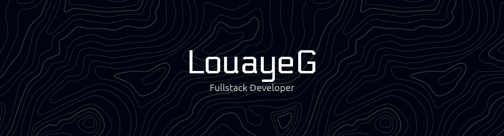

<h3 align="center">Hi 👋, I'm Louaye Gafaiti</h3>

<h3 align="center">
Full-Stack Developer specializing in Laravel, Vue & Modern Web Architectures
</h3>

I build high-performance web applications and scalable CRM systems with a strong focus on user experience and clean architecture.

🚀 Creator of [ Mousaidati / Ovinob / Hikma Gluten Free ] Systems  
💻 Tech Stack: Laravel • Vue • React • Next.js • TypeScript • PostgreSQL 
⚡ Passionate about performance optimization, UI/UX, and real-world solutions 
📍 Morocco

  <picture align="center">
    <source media="(prefers-color-scheme: dark)" srcset="https://raw.githubusercontent.com/platane/platane/output/github-contribution-grid-snake-dark.svg">
    <source media="(prefers-color-scheme: light)" srcset="https://raw.githubusercontent.com/platane/platane/output/github-contribution-grid-snake.svg">
    
  </picture>

